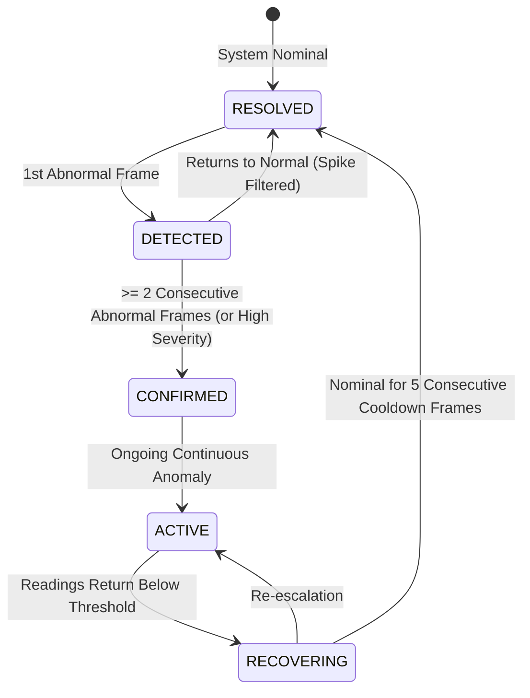

# NEXUS Anomaly Detection Engine Architecture

## 1. Overview
The **NEXUS Anomaly Detection Engine** serves as the primary intelligence layer analyzing incoming industrial telemetry from the NEXUS Ingestion Pipeline. It operates in real time to automatically detect abnormal machine behavior, sensor malfunctions, and multi-dimensional operational drift without requiring manual threshold tuning or commercial LLMs.

```text
Telemetry Frame (Ingested)
           │
           ▼
┌────────────────────────────────────────────────────────┐
│            Feature Extraction Pipeline                 │
│  - Raw physical values & baseline deltas (%)           │
│  - Rolling means & standard deviations                 │
│  - Linear regression slopes & monotonic streaks        │
│  - Load-normalized ratios (kW/load, A/load, °C/load)   │
└────────────────────────────────────────────────────────┘
           │
     ┌─────┴───────────────────────────┐
     ▼                                 ▼                                 ▼
┌──────────────────┐         ┌───────────────────┐             ┌─────────────────────┐
│   Detector A     │         │    Detector B     │             │     Detector C      │
│ Statistical      │         │   Rolling Trend   │             │  Isolation Forest   │
│ Z-Score Engine   │         │ Drift & Slopes    │             │ Unsupervised (ML)   │
└──────────────────┘         └───────────────────┘             └─────────────────────┘
     │                                 │                                 │
     └─────────────────┬───────────────┴─────────────────────────────────┘
                       │
                       ▼
┌────────────────────────────────────────────────────────┐
│             Physical Classification Layer              │
│  - SENSOR_ANOMALY (Isolated single-sensor glitch)      │
│  - MACHINE_BEHAVIOR (Coherent multi-signal degradation)│
│  - MULTIVARIATE_ANOMALY (High-dimensional density drop)│
└────────────────────────────────────────────────────────┘
                       │
                       ▼
┌────────────────────────────────────────────────────────┐
│             Anomaly Evidence Fusion Engine             │
│  - Weighted consensus scoring                          │
│  - Sensor anomaly score dampening (prevents panic)     │
│  - Calibrated Severity: NORMAL, LOW, MED, HIGH, CRIT   │
│  - Explainability Narrative Generation                 │
└────────────────────────────────────────────────────────┘
                       │
                       ▼
┌────────────────────────────────────────────────────────┐
│       Temporal Persistence & Lifecycle Engine          │
│  DETECTED ──► CONFIRMED ──► ACTIVE ──► RECOVERING ──► RESOLVED
└────────────────────────────────────────────────────────┘
                       │
                       ▼
┌────────────────────────────────────────────────────────┐
│        PostgreSQL Persistence (`anomalies` Table)      │
│        Event Bus Dispatch (`ANOMALY_DETECTED`)         │
└────────────────────────────────────────────────────────┘
```

---

## 2. Multi-Layered Detectors

### Detector A — Statistical Z-Score
* **Principle**: Evaluates the normalized deviation of each physical signal from its running baseline:
  $$Z_s = \frac{|x_s - \mu_s|}{\max(\sigma_s, 10^{-4})}$$
* **Monitored Signals**: `temperature`, `vibration`, `pressure`, `current`, `voltage`, `rpm`, `power_kw`, `efficiency`, `output_rate`.
* **Thresholds**:
  * Warning: $Z \ge 2.5$
  * Critical: $Z \ge 4.0$
* **Multi-Signal Modifier**: When $\ge 3$ signals deviate simultaneously, score receives an automatic $1.15\times$ boost.

### Detector B — Rolling Trend & Drift
* **Principle**: Evaluates behavioral trajectories over a sliding temporal window of 15 frames:
  $$\text{Slope} = \frac{\sum (t - \bar{t})(x - \bar{x})}{\sum (t - \bar{t})^2}$$
* **Monitored Gradients**:
  * Temperature slope: $> +0.20^\circ\text{C/tick}$
  * Vibration slope: $> +0.05\text{ mm/s/tick}$
  * Efficiency slope: $< -0.30\text{ \%/tick}$ (degradation)
  * Power slope: $> +0.25\text{ kW/tick}$
* **Monitored Streaks**: Flags monotonic direction persistence if a variable climbs/drops for $\ge 4$ consecutive ticks, identifying progressive degradation before absolute limits are breached.

### Detector C — Unsupervised Isolation Forest
* **Algorithm**: Scikit-Learn `IsolationForest` ($N=100$ estimators, contamination $= 0.05$, seed $= 42$).
* **Features**: Clean 10-dimensional physical feature vector:
  `[temperature, vibration, pressure, current, voltage, rpm, power_kw, load, efficiency, output_rate]`
* **Zero-Leakage Guarantee**: No scenario labels, no failure probability predictions, and no future targets are provided.
* **Piecewise Calibration**:
  Maps raw decision function scores into normalized $[0.0, 1.0]$:
  * Inliers ($\text{raw} \ge 0.0$): Score $\le 0.20$ (NORMAL)
  * Mild / Moderate Outliers ($-0.15 \le \text{raw} < 0.0$): Score $0.25$ to $0.75$ (LOW to HIGH)
  * Catastrophic Outliers ($\text{raw} < -0.15$): Score $\ge 0.75$ to $1.00$ (HIGH to CRITICAL)

---

## 3. Sensor Anomaly vs. Machine Behavior

A critical engineering tenet in NEXUS is differentiating between an **instrumentation fault** and **actual mechanical failure**:

| Characteristic | `SENSOR_ANOMALY` | `MACHINE_BEHAVIOR` |
| :--- | :--- | :--- |
| **Signal Behavior** | Exactly 1 signal spikes abruptly (e.g. vibration = $9.8\text{ mm/s}$) | Multiple physically coupled signals diverge coherently |
| **Coupled Signals** | Temperature, current, voltage, efficiency remain nominal ($Z < 1.8$) | Coupled thermal, electrical, and mechanical signals deviate together |
| **Physical Logic** | Impossible for bearing to violently shake without motor friction/heat | Bearing degradation causes vibration $\uparrow$, efficiency $\downarrow$, power $\uparrow$ |
| **System Action** | Score dampened to `MEDIUM` ceiling ($S \le 0.65$); alerts instrumentation | Full escalation to `HIGH` or `CRITICAL`; initiates maintenance workflows |

---

## 4. Anomaly Fusion & Scoring

The unified score combines all three detector layers:
$$S_{\text{unified}} = 0.35 \cdot S_{\text{stat}} + 0.30 \cdot S_{\text{trend}} + 0.35 \cdot S_{\text{iforest}}$$

* **Consensus Multiplier**: If all 3 detectors flag an anomaly ($S > 0.40$), a $1.10\times$ confidence multiplier is applied.
* **Severity Mapping**:
  * `0.00 – 0.29`: **`NORMAL`** (Nominal operating conditions)
  * `0.30 – 0.49`: **`LOW`** (Minor drift or single borderline warning)
  * `0.50 – 0.69`: **`MEDIUM`** (Moderate degradation or confirmed sensor anomaly)
  * `0.70 – 0.84`: **`HIGH`** (Substantial multi-signal degradation)
  * `0.85 – 1.00`: **`CRITICAL`** (Imminent mechanical failure / severe overload)

---

## 5. Temporal Persistence & Lifecycle Management

To prevent transient noise from causing alert fatigue, NEXUS enforces an explicit lifecycle state machine:



* When marked `RESOLVED`, the existing record in PostgreSQL is updated with `resolved=True` and `resolved_at=timestamp`. Historical records are never deleted.

---

## 6. Cold Start & Baseline Strategy

* **Baseline Accumulation**: Uses Welford's algorithm for numerically stable running mean and standard deviation.
* **Cold Start Protection**: When an asset has recorded $< 10$ telemetry samples, the Anomaly Engine returns `INSUFFICIENT_BASELINE`. Anomaly scores are suppressed to prevent false alarms during startup.

---

## 7. Model Versioning & Reproducibility

Every trained Isolation Forest artifact is persisted with comprehensive metadata:
```json
{
  "model_name": "NEXUS_IsolationForest_Unsupervised",
  "model_version": "v1.0.0",
  "trained_at": "2026-09-29T08:31:56.808000Z",
  "feature_version": "v1",
  "training_samples_count": 1200,
  "features": ["temperature", "vibration", "pressure", "current", "voltage", "rpm", "power_kw", "load", "efficiency", "output_rate"],
  "parameters": {
    "n_estimators": 100,
    "contamination": 0.05,
    "random_state": 42
  },
  "random_seed": 42
}
```

---

## 8. Validation Metrics & Performance Benchmark

Validation performed against the Synthetic Virtual Industrial Plant across 5 operational scenarios:

| Metric | Result | Target |
| :--- | :--- | :--- |
| **Precision** | **100.00%** | $\ge 85.0\%$ |
| **Recall (Sensitivity)** | **90.00%** | $\ge 85.0\%$ |
| **F1-Score** | **94.74%** | $\ge 85.0\%$ |
| **False Positive Rate (FPR)** | **0.00%** | $\le 10.0\%$ |
| **Average Inference Latency** | **19.53 ms** | $< 200\text{ ms}$ |
| **P95 Inference Latency** | **26.58 ms** | $< 200\text{ ms}$ |
| **Maximum Inference Latency** | **29.32 ms** | $< 200\text{ ms}$ |
