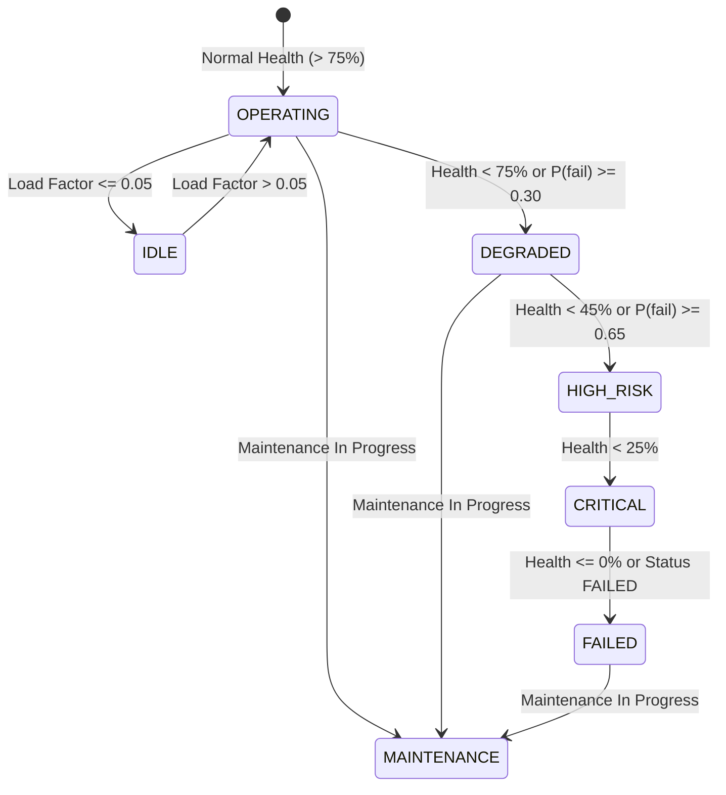

# NEXUS Digital Twin Engine Architecture

## 1. Overview
The **NEXUS Digital Twin Engine** maintains an up-to-the-millisecond virtual replica of every physical and simulated industrial machine in the enterprise. It dynamically estimates operational health, monitors failure probabilities, tracks telemetry freshness, and continuously reflects deterministic state transitions.

```text
Telemetry Frame Ingested
           │
           ▼
┌────────────────────────────────────────────────────────┐
│               Digital Twin Engine                      │
│                                                        │
│  1. Dynamic Health Evaluation                          │
│  2. Failure Probability Recalculation                 │
│  3. Deterministic State Transition Matrix             │
│  4. Data Freshness Tracking (FRESH / STALE / UNKNOWN) │
│  5. Persistence to `machine_states` table              │
│  6. In-Memory Fast Lookup Cache Update                 │
└────────────────────────────────────────────────────────┘
           │
           ├──► `GET /api/v1/machines/{machine_id}/state`
           ├──► `GET /api/v1/machines/states`
           └──► `GET /api/v1/factory/state` (Factory-wide Snapshot)
```

---

## 2. State Machine & Transition Rules

Machine status is calculated deterministically to provide transparent, explainable state transitions:



### Deterministic Thresholds:
* **`FAILED`**: Explicit failure status or `health_score <= 0.0`.
* **`MAINTENANCE`**: Maintenance status set to `"MAINTENANCE"` or `"IN_PROGRESS"`.
* **`CRITICAL`**: `health_score < 25.0` or `failure_probability >= 0.85`.
* **`HIGH_RISK`**: `health_score < 45.0` or `failure_probability >= 0.65`.
* **`DEGRADED`**: `health_score < 75.0` or `failure_probability >= 0.30`.
* **`IDLE`**: `load_factor <= 0.05` and healthy.
* **`OPERATING`**: Nominal operational state.

---

## 3. Dynamic Freshness Tracking

To avoid making critical operational decisions on outdated data, NEXUS continuously evaluates telemetry freshness:

```python
elapsed_seconds = (now_utc - last_telemetry_timestamp).total_seconds()
```

* **`FRESH`**: `elapsed_seconds <= 60.0` (active live telemetry feed).
* **`STALE`**: `elapsed_seconds > 60.0` (communication dropout, sensor offline).
* **`UNKNOWN`**: No telemetry has ever been recorded for this asset.

When machines enter `STALE` status, warning events are emitted on the event bus, alerting operators and downstream intelligence engines.

---

## 4. Factory Snapshot

The Digital Twin aggregates enterprise-wide state via `GET /api/v1/factory/state`:

```json
{
  "factory_id": "FACTORY_01",
  "timestamp": "2026-09-29T08:11:34.079213Z",
  "total_machines": 6,
  "operating_machines": 6,
  "degraded_machines": 0,
  "high_risk_machines": 0,
  "failed_machines": 0,
  "stale_machines": 0,
  "overall_health": 82.8,
  "active_scenarios": 0,
  "latest_telemetry_timestamp": "2026-09-29T08:11:31.885000Z",
  "machines": [ ... ]
}
```

---

## 5. Observability & Performance Metrics

Real-time pipeline statistics are exposed at `GET /metrics`:
* **Throughput**: `telemetry_received_total`, `telemetry_accepted_total`, `telemetry_duplicate_total`, `telemetry_rejected_total`.
* **Latencies**: Rolling average, max, and P95 measurements for ingestion persistence and Digital Twin evaluation.
* **SLA Performance**:
  * Telemetry Ingestion P95: `< 15 ms` (Requirement: `< 500 ms`).
  * Digital Twin P95: `< 25 ms` (Requirement: `< 500 ms`).
